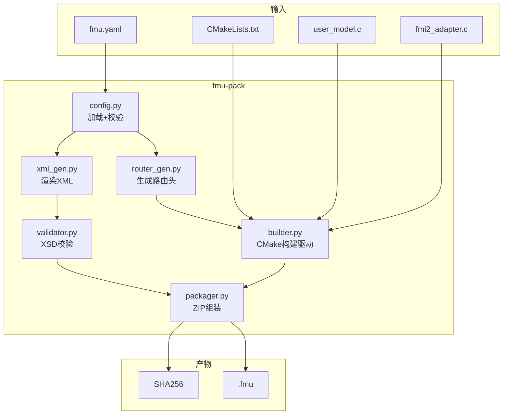
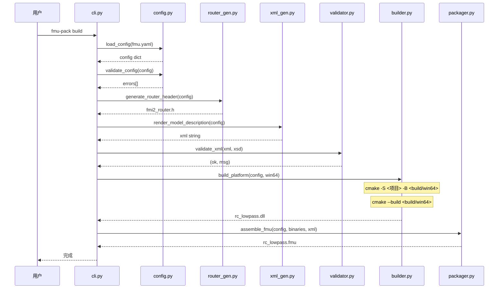
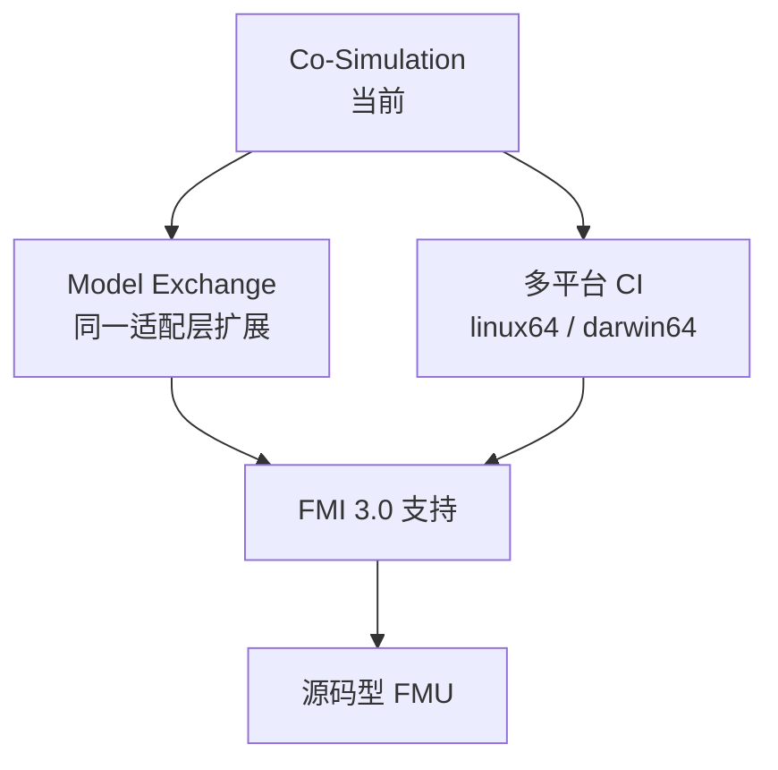
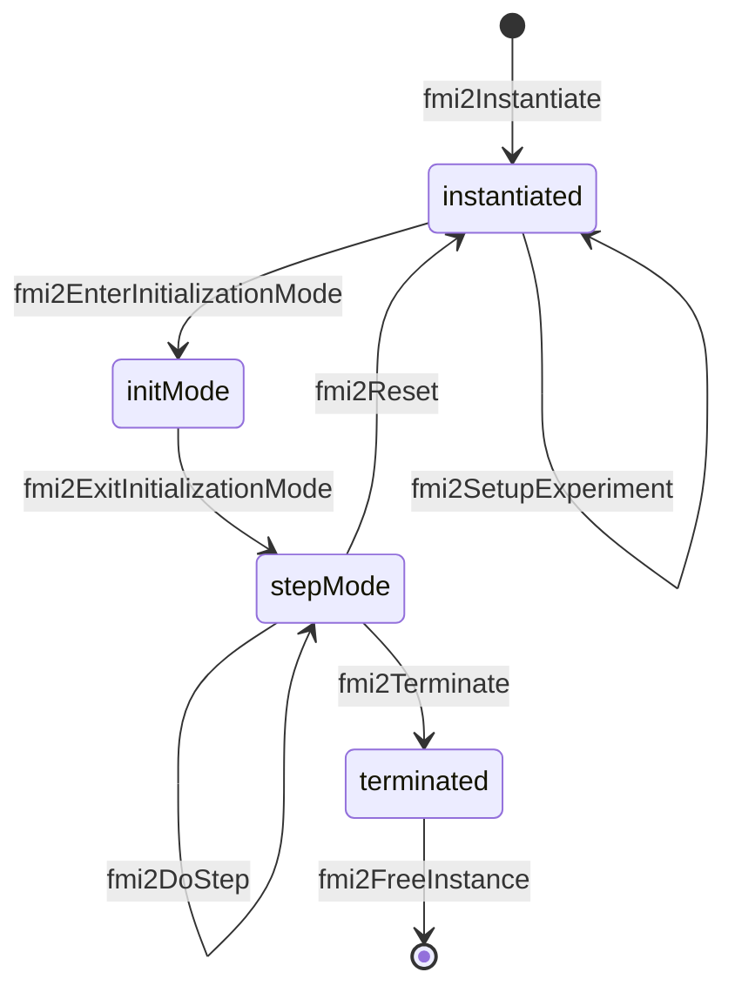

# FMU 与打包工具设计

> 本文档描述 FMU 项目结构、适配层架构和 `tools/fmu_pack/` 打包工具的设计。
> 只写 why / what / 架构 / 模块边界 / 数据流 / 接口约定；不贴具体代码实现。

---

## 1. 概述

`fmu-pack` 是一个 Python CLI 工具，将用户 C 数值模型封装为符合 **FMI 2.0 Co-Simulation** 规范的 `.fmu` 文件。

### 1.1 一句话定位

> 给定 `fmu.yaml` + C 源码 → 一行命令产出标准 `.fmu`。

### 1.2 与 fmi-standard 仓库的关系

| 能力 | fmi-standard 仓库 | 本项目 |
|---|---|---|
| FMI 2.0 头文件 | ❌ 仓库仅 3.0 | 从 v2.0.x 分支提取到 `third_party/fmi2/` |
| FMI 2.0 XSD | ❌ | 同上 |
| modelDescription.xml 生成 | ❌ | ✅ Jinja2 模板渲染 |
| **FMI 2.0 适配层** | ❌ | ✅ **代码生成，用户不碰 FMI 细节** |
| C 源码编译 | ❌ | ✅ CMake out-of-source 构建 |
| .fmu ZIP 打包 | ❌ | ✅ 符合 FMI 2.0 目录结构 |
| XSD 校验 | ❌ | ✅ lxml 校验 |

### 1.3 核心设计原则：用户只写模型

**用户不写任何 FMI 相关代码**。所有 FMI 2.0 样板（30+ 个导出函数、状态机、VR 路由、get/setReal 分发）由 `fmu-pack` 自动生成。

用户只需：
1. 写 `fmu.yaml`（声明变量、模型）
2. 写 `user_model.h`（状态结构体 + 三个回调声明）
3. 写 `user_model.c`（实现 init / step / terminate 三个函数）

**用户从不**：
- `#include "fmi2Functions.h"`
- 写 `fmi2Instantiate` / `fmi2DoStep` 等
- 维护 VR 枚举
- 维护 modelDescription.xml
- 维护 CMakeLists.txt（由 `fmu-pack init` 生成模板）

---

## 2. 项目目录结构

### 2.1 仓库根目录

```
fmu_test/
├── run_fmu_pack.py              # 直接运行入口（无需 pip install）
├── requirements.txt             # Python 依赖
├── tools/
│   └── fmu_pack/                # FMU 打包工具（Python 包）
│       ├── __init__.py           # 包入口，版本号
│       ├── cli.py                # CLI 入口
│       ├── config.py             # fmu.yaml 加载/校验/GUID 固化
│       ├── adapter_gen.py        # 【核心】fmi2_adapter.c 代码生成器
│       ├── router_gen.py         # fmi2_router.h VR 路由生成器
│       ├── xml_gen.py            # modelDescription.xml Jinja2 渲染
│       ├── validator.py          # XSD schema 校验
│       ├── builder.py            # CMake 构建驱动
│       └── packager.py           # ZIP 组装 + SHA256
├── fmus/
│   └── <name>/                   # 各 FMU 项目
├── third_party/
│   ├── fmi2/                     # FMI 2.0 头文件 + XSD
│   │   ├── include/
│   │   └── schema/
│   └── zeromq/                   # 第三方静态库
├── doc/
│   └── FMU和打包设计.md          # 本文档
└── .venv/                        # Python 虚拟环境
```

### 2.2 FMU 项目结构（用户视角）

**目标：用户只写 3 个文件**（`fmu.yaml` + `user_model.h` + `user_model.c`）。

```
fmus/<name>/
├── fmu.yaml              # 用户写：变量、模型、链接
├── include/
│   └── user_model.h      # 用户写：状态结构体 + 3 个回调声明
└── src/
    └── user_model.c      # 用户写：init / step / terminate 实现
```

**fmu-pack 自动生成**（到 `build/` 下，用户无需管理）：
- `build/fmi2_router.h` — VR 路由表
- `build/fmi2_adapter.c` — FMI 2.0 完整适配层
- `build/modelDescription.xml` — FMU 描述文件
- `build/win64/<mi>.dll` — 编译产物

**可选**（项目需要时）：
- `CMakeLists.txt` — 静态 CMake 配置（覆盖默认行为或加外部库）

### 2.3 默认 CMakeLists.txt（可选）

如果项目没有 `CMakeLists.txt`，`fmu-pack` 会使用内置模板：

```cmake
cmake_minimum_required(VERSION 3.20)
project(<modelIdentifier> C)

include_directories("${CMAKE_SOURCE_DIR}/include")
include_directories("..."/third_party/fmi2/include)

add_library(<modelIdentifier> SHARED
    src/user_model.c
    build/fmi2_adapter.c        # 工具生成
)
target_include_directories(<modelIdentifier> PRIVATE build)

target_compile_definitions(<modelIdentifier> PRIVATE
    "FMI2_Export=__declspec(dllexport)"
)
```

需要外部库（ZeroMQ 等）时，用户在 `fmu.yaml` 声明，工具自动扩展模板。

---

## 3. 架构



### 3.1 分层职责

| 模块 | 知道什么 | 不知道什么 |
|---|---|---|
| config.py | YAML 结构、FMI 2.0 字段约束 | C 代码、编译细节 |
| **adapter_gen.py** | **FMI 2.0 完整 API、状态机、回调协议** | **用户模型物理、XML、zip** |
| router_gen.py | vr↔字段名映射、枚举生成 | XML、zip |
| xml_gen.py | FMI 2.0 XML schema、Jinja2 模板 | 编译、C 代码 |
| validator.py | XSD schema 校验 | 业务逻辑 |
| builder.py | CMake out-of-source 构建 | FMI 语义 |
| packager.py | ZIP 目录结构、SHA256 | 编译 |

---

## 4. 关键模块设计

### 4.1 config.py —— 配置加载与校验

**输入**: `fmu.yaml` 文件路径

**处理**:
1. YAML 解析
2. GUID 自动生成（首次 `"auto"` → UUIDv4，写回文件固化）
3. 逐字段校验（见 §5.1 契约约束）

**输出**: 配置字典 + 错误列表

### 4.2 router_gen.py —— VR 路由头生成

**输入**: 配置字典（variables 列表 + model.state_type）

**输出**: `fmi2_router.h`（写入 `include/` 目录）

**生成内容**:
- `valueReference` 枚举（`VR_TAU = 1, VR_U = 2, ...`）
- `getReal` 路由函数（static inline, switch-case）
- `setReal` 路由函数（仅 input/parameter 可写）

**关键设计决策**:
- 路由函数使用用户定义的结构体类型（`model.state_type`），不自建结构体
- 函数声明为 `static inline`，避免链接冲突
- output 变量不出现在 setReal 路由中

### 4.3 xml_gen.py —— XML 模板渲染

**输入**: 配置字典

**输出**: `modelDescription.xml` 字符串

**模板变量**:
- `fmi.version`, `fmi.kind`, `fmi.modelIdentifier`, `fmi.guid`, `fmi.generationTool`
- `variables`: 变量列表
- `outputs`: causality=output 的 1-based 索引
- `generation_time`: UTC 时间戳

**ModelStructure 计算规则**:
- Outputs: 所有 `causality=output` 的变量索引
- Derivatives: `causality=local` 且标记了 derivative 的变量
- InitialUnknowns: `initial=approx` 的 output/local 变量

### 4.4 validator.py —— XSD 校验

**输入**: XML 字符串 + XSD 文件路径

**校验流程**:
1. `etree.fromstring` 解析 XML
2. `etree.parse` + `XMLSchema` 加载 XSD
3. `assertValid` 全量校验

**错误类型**: XMLSyntaxError / XMLSchemaParseError / DocumentInvalid

### 4.5 builder.py —— CMake 构建驱动

**输入**: 配置 + 项目目录 + 目标平台

**构建策略**:
- 每个 FMU 项目自带 `CMakeLists.txt`（项目源文件，可版本管理）
- builder 只做 out-of-source 构建：`cmake -S <项目> -B <build/平台>`
- 不生成任何隐式文件

**CMakeLists.txt 两种典型形态**:

纯 C 项目（rc_lowpass）：
```cmake
project(rc_lowpass C)
include_directories("${CMAKE_SOURCE_DIR}/../../third_party/fmi2/include")
include_directories("${CMAKE_SOURCE_DIR}/include")
add_library(rc_lowpass SHARED src/user_model.c src/fmi2_adapter.c)
```

C 源码 + C++ 静态库（zmqsub）：
```cmake
project(zmqsub C CXX)
add_library(zmqsub SHARED src/user_model.c src/fmi2_adapter.c)
set_target_properties(zmqsub PROPERTIES LINKER_LANGUAGE CXX)
target_compile_definitions(zmqsub PRIVATE ZMQ_STATIC)
target_link_libraries(zmqsub PRIVATE
    "${CMAKE_SOURCE_DIR}/../../third_party/zeromq/lib/libzmq.a"
    ws2_32 iphlpapi)
```

**产物**: `<modelIdentifier>.dll`（win64）/ `.so`（linux64）/ `.dylib`（darwin64）

### 4.6 packager.py —— ZIP 组装

**输入**: 配置 + 二进制字典 + XML 路径 + 项目目录

**ZIP 内部结构**:
```
modelDescription.xml
binaries/win64/<mi>.dll
resources/          (可选)
documentation/      (可选)
```

**平台目录映射**（FMI 2.0 约定）:
| 平台 | 目录 |
|---|---|
| win64 | `binaries/win64/` |
| linux64 | `binaries/linux64/` |
| darwin64 | `binaries/darwin64/` |

**后处理**: 生成 SHA256 manifest 文件

### 4.7 adapter_gen.py —— FMI 适配层代码生成器

**输入**: 配置字典（model.prefix, model.state_type, variables 列表）

**输出**: `build/fmi2_adapter.c`（用户项目里**不存在**这个文件）

**生成内容**: FMI 2.0 完整 C API（30+ 个导出函数）+ 状态机 + 回调调用

**核心模板片段**（简化）:

```c
/* 由 fmu-pack 自动生成，勿手动编辑 */
#include "fmi2Functions.h"
#include "fmi2_router.h"
#include "user_model.h"

typedef struct {
    {StateType} model;             /* 用户状态 */
    FmuState state;
    fmi2CallbackFunctions callbacks;
    ...
} ModelInstance;

FMI2_Export fmi2Component fmi2Instantiate(...) {
    ...
    if ({prefix}_init(&inst->model) != 0) return NULL;
    ...
}

FMI2_Export fmi2Status fmi2DoStep(...) {
    ...
    {prefix}_step(&inst->model, currentCommunicationPoint, communicationStepSize);
    ...
}

FMI2_Export fmi2Status fmi2GetReal(...) {
    {prefix}_route_getReal(&inst->model, vr, nvr, value);
    return fmi2OK;
}

/* 未实现功能统一返回 fmi2Error */
FMI2_Export fmi2Status fmi2GetInteger(...) { return fmi2Error; }
FMI2_Export fmi2Status fmi2GetBoolean(...) { return fmi2Error; }
... (10+ 个)
```

**用户从不修改此文件**。每次 `fmu-pack build` 重新生成。

---

## 5. 接口约定

### 5.1 `fmu.yaml` 契约

```yaml
fmi:
  version: "2.0"               # 强制 2.0
  kind: "CoSimulation"          # 首期只支持 CoSimulation
  modelIdentifier: "MyModel"   # → dll 基名
  guid: "auto"                  # 缺省自动生成 UUIDv4
  generationTool: "fmu-pack 0.1.0"

variables:
  - { name: "tau", vr: 1, type: "Real", causality: "parameter", start: 1.0, variability: "fixed" }
  - { name: "u",   vr: 2, type: "Real", causality: "input" }
  - { name: "y",   vr: 3, type: "Real", causality: "output" }

model:
  step: "euler"                 # 积分器类型
  state_type: "RcState"         # 用户模型状态结构体类型名
  sources: ["src/user_model.c"] # C 源文件列表

platforms: ["win64"]            # 目标平台
```

**契约约束**:
1. `vr` 唯一，正整数，≥ 1
2. `causality=output` 不能有 `start`
3. `causality=parameter` 必须有 `variability=fixed|tunable|discrete`
4. `modelIdentifier` 匹配 `[A-Za-z_][A-Za-z0-9_]*`
5. `guid` 一旦生成就不可变

### 5.2 用户模型 ↔ 适配层（C ABI）

用户模型暴露三个回调：
- `xxx_init(state)` — 初始化
- `xxx_step(state, t, dt)` — 单步推进
- `xxx_terminate(state)` — 销毁

适配层通过 `fmi2_router.h` 中的路由函数访问模型状态字段。

### 5.3 CMakeLists.txt 约定

每个 FMU 项目根目录必须包含 `CMakeLists.txt`，作为项目源文件的一部分，纳入版本管理。

**约定**:
- 使用 `${CMAKE_SOURCE_DIR}/../../third_party/` 引用仓库级第三方库
- 使用 `${CMAKE_SOURCE_DIR}/include` 引用项目头文件
- 产物命名为 `<modelIdentifier>`（与 `fmu.yaml` 中的 `modelIdentifier` 一致）
- 外部库采用静态链接，确保 FMU 自包含

### 5.4 CLI 接口

| 命令 | 作用 | 退出码 |
|---|---|---|
| `fmu-pack init [dir]` | 生成 fmu.yaml 模板 | 0/1 |
| `fmu-pack validate [--xsd]` | 校验配置 + XSD | 0/2/3 |
| `fmu-pack build [--platform] [--xsd]` | 完整构建 | 0/2/3/4/5 |
| `fmu-pack gen-router` | 仅生成路由头 | 0 |
| `fmu-pack inspect <fmu>` | 查看 FMU 内部结构 | 0/1 |
| `fmu-pack clean [dir]` | 清理 build/ dist/ | 0 |

**退出码**:
| 码 | 含义 |
|---|---|
| 0 | 成功 |
| 1 | 一般错误 |
| 2 | fmu.yaml 校验失败 |
| 3 | XML/XSD 校验失败 |
| 4 | 构建失败 |
| 5 | 打包失败 |

---

## 6. 数据流



---

## 7. 依赖

| 项 | 选型 | 用途 |
|---|---|---|
| Python | ≥ 3.10 | 运行环境 |
| Jinja2 | ≥ 3.0 | XML 模板渲染 |
| lxml | ≥ 4.9 | XSD schema 校验 |
| PyYAML | ≥ 6.0 | fmu.yaml 解析 |
| CMake | ≥ 3.20 | C 项目构建 |
| GCC/MinGW | 系统安装 | C/C++ 编译 |
| ZeroMQ | 4.3.5 (静态库) | zeromq_sub FMU 网络通信 |

---

## 8. FMU 项目模板

### 8.1 纯 C 项目（rc_lowpass）

**用户写的文件**（3 个）:
```
fmus/rc_lowpass/
├── fmu.yaml                # 声明：变量、模型、回调前缀
├── include/
│   └── user_model.h        # 状态结构体 + 三个回调声明
└── src/
    └── user_model.c        # init / step / terminate 实现
```

**`fmu.yaml` 内容**:
```yaml
fmi:
  modelIdentifier: "rc_lowpass"
  ...
model:
  prefix: "rc"               # 工具推导: rc_init / rc_step / rc_terminate
  state_type: "RcState"
  sources: ["src/user_model.c"]
```

**`user_model.h` 内容**:
```c
typedef struct { double tau, u, y; } RcState;
int  rc_init(RcState*);
int  rc_step(RcState*, double t, double dt);
void rc_terminate(RcState*);
```

**`user_model.c` 内容**:
```c
#include "user_model.h"

int rc_init(RcState* s) {
    s->tau = 1.0; s->u = 0.0; s->y = 0.0; return 0;
}
int rc_step(RcState* s, double t, double dt) {
    s->y += dt * (s->u - s->y) / s->tau;
    return 0;
}
void rc_terminate(RcState* s) { (void)s; }
```

**工具自动生成**（到 `build/` 下）:
- `build/fmi2_adapter.c` — 完整 FMI 2.0 适配层
- `build/fmi2_router.h` — VR 路由表
- `build/modelDescription.xml` — FMU 描述
- `build/win64/rc_lowpass.dll` — 编译产物

### 8.2 C + 外部静态库项目（zeromq_sub）

**用户写的文件**（3 个 + 可选 CMakeLists.txt）:
```
fmus/zeromq_sub/
├── CMakeLists.txt           # 可选：用户写（项目级第三方链接）
├── fmu.yaml                 # 声明 + model.link 字段
├── include/
│   └── user_model.h
└── src/
    └── user_model.c         # 含 #include <zmq.h>
```

**`fmu.yaml` 额外字段**:
```yaml
model:
  prefix: "zmqsub"
  state_type: "ZmqSubState"
  sources: ["src/user_model.c"]
  link:
    zeromq:
      include: "../../third_party/zeromq/include"
      lib_dir: "../../third_party/zeromq/lib"
      libs: ["zmq"]
```

工具根据 `link` 段自动扩展默认 CMakeLists.txt：
```cmake
project(zmqsub C CXX)
add_library(zmqsub SHARED src/user_model.c build/fmi2_adapter.c)
set_target_properties(zmqsub PROPERTIES LINKER_LANGUAGE CXX)
target_compile_definitions(zmqsub PRIVATE ZMQ_STATIC)
target_link_libraries(zmqsub PRIVATE
    "${CMAKE_SOURCE_DIR}/../../third_party/zeromq/lib/libzmq.a"
    ws2_32 iphlpapi)
```

---

## 9. 扩展方向



- **Model Exchange**: 适配层加 `fmi2GetDerivatives` / `fmi2GetContinuousStates` 等
- **多平台**: GitHub Actions 矩阵构建，各平台只需配置对应的 CMake generator
- **FMI 3.0**: 切换头文件 + 适配层复制一份 `fmi3_adapter.c`
- **源码型 FMU**: `fmu.yaml` 加 `distribution=source`，打包时包含 `sources/`

---

## 10. 适配层代码生成设计

### 10.1 目标：用户只写模型

**用户**:
```c
// user_model.h
typedef struct {
    double tau, u, y;
} RcState;

int rc_init(RcState*);
int rc_step(RcState*, double t, double dt);
void rc_terminate(RcState*);
```

```c
// user_model.c
int rc_init(RcState* s) { s->tau=1.0; s->u=0.0; s->y=0.0; return 0; }
int rc_step(RcState* s, double t, double dt) {
    s->y += dt * (s->u - s->y) / s->tau;
    return 0;
}
void rc_terminate(RcState* s) { (void)s; }
```

**用户不写**:
- ❌ `fmi2Instantiate` 等 30+ 导出函数
- ❌ 状态机
- ❌ VR 枚举与 switch-case
- ❌ `modelDescription.xml`
- ❌ `CMakeLists.txt`（无外部库时）

### 10.2 用户-工具契约

**`fmu.yaml`** 声明：
```yaml
fmi:
  modelIdentifier: "rc_lowpass"
  ...

variables:
  - { name: "tau", vr: 1, type: "Real", causality: "parameter", start: 1.0, variability: "fixed" }
  - { name: "u",   vr: 2, type: "Real", causality: "input" }
  - { name: "y",   vr: 3, type: "Real", causality: "output" }

model:
  prefix: "rc"            # ← 工具推导三个回调名: rc_init / rc_step / rc_terminate
  state_type: "RcState"   # ← 工具知道状态结构体类型
  sources: ["src/user_model.c"]
```

**`user_model.h`** 暴露（用户写）：
```c
typedef struct { double tau, u, y; } RcState;
int  rc_init(RcState*);
int  rc_step(RcState*, double t, double dt);
void rc_terminate(RcState*);
```

**三个回调的硬约定**:
| 回调 | 签名 | 语义 |
|---|---|---|
| `<prefix>_init` | `(state) → int` | 初始化状态；0=成功 |
| `<prefix>_step` | `(state, t, dt) → int` | 单步推进；0=成功 |
| `<prefix>_terminate` | `(state) → void` | 释放资源 |

### 10.3 工具自动生成

```
                    fmu.yaml
                       │
        ┌──────────────┼──────────────┐
        ↓              ↓              ↓
   adapter_gen.py   router_gen.py  xml_gen.py
        │              │              │
        ↓              ↓              ↓
  build/           build/          build/
  fmi2_adapter.c   fmi2_router.h   modelDescription.xml
        │              │              │
        └──────────────┬──────────────┘
                       ↓
                   CMake 构建
                       ↓
                  <mi>.dll/.so
```

**生成文件清单**（全部在 `build/` 下，不污染项目）:
| 文件 | 内容 | 大小 |
|---|---|---|
| `build/fmi2_adapter.c` | FMI 2.0 API 30+ 函数 + 状态机 | ~400 行 |
| `build/fmi2_router.h` | VR 枚举 + get/setReal switch-case | ~50 行 |
| `build/modelDescription.xml` | FMU 描述 | ~1.5 KB |

### 10.4 `adapter_gen.py` 实现思路

**输入**: fmu.yaml + 用户项目（user_model.h）

**输出**: fmi2_adapter.c

**模板骨架**（C 字符串模板）:

```c
/* ============================================================
 * fmi2_adapter.c —— 由 fmu-pack 自动生成，勿手动编辑
 * 模型: {modelIdentifier}
 * 状态类型: {state_type}
 * 回调前缀: {prefix}
 * ============================================================ */

#include "fmi2Functions.h"
#include "fmi2_router.h"
#include "user_model.h"
#include <stdio.h>
#include <stdlib.h>
#include <string.h>

/* ---- 适配层内部状态 ---- */
typedef enum { STATE_INSTANTIATED, STATE_INIT_MODE,
               STATE_STEP_MODE, STATE_TERMINATED } FmuState;

typedef struct {
    {StateType} model;             /* 用户状态 */
    FmuState state;
    fmi2Real t_start, t_current;
    fmi2String instance_name;
    fmi2CallbackFunctions callbacks;
    fmi2Boolean logging_on;
} ModelInstance;

static void log_msg(ModelInstance* inst, fmi2Status status,
                    const char* cat, const char* msg) {
    if (inst && inst->callbacks.logger && inst->logging_on)
        inst->callbacks.logger(inst->callbacks.componentEnvironment,
                                inst->instance_name, status, cat, msg);
}

/* ---- FMI 2.0 公共符号 ---- */
FMI2_Export fmi2GetTypesPlatformTYPE fmi2GetTypesPlatform;
... (30+ 个函数指针声明)

/* ---- 实现 ---- */

FMI2_Export const char* fmi2GetTypesPlatform(void) { return fmi2TypesPlatform; }
FMI2_Export const char* fmi2GetVersion(void) { return fmi2Version; }

FMI2_Export fmi2Component fmi2Instantiate(...) {
    /* ... 状态机守卫 + {prefix}_init 调用 ... */
}

FMI2_Export fmi2Status fmi2SetupExperiment(...) { ... }
FMI2_Export fmi2Status fmi2EnterInitializationMode(...) { ... }
FMI2_Export fmi2Status fmi2ExitInitializationMode(...) { ... }
FMI2_Export fmi2Status fmi2Terminate(...) { ... }
FMI2_Export fmi2Status fmi2Reset(...) {
    {prefix}_terminate(&inst->model);
    {prefix}_init(&inst->model);
    return fmi2OK;
}

FMI2_Export fmi2Status fmi2GetReal(...) {
    {prefix}_route_getReal(&inst->model, vr, nvr, value);
    return fmi2OK;
}

FMI2_Export fmi2Status fmi2SetReal(...) {
    {prefix}_route_setReal(&inst->model, vr, nvr, value);
    return fmi2OK;
}

FMI2_Export fmi2Status fmi2DoStep(...) {
    int ret = {prefix}_step(&inst->model, currentCommunicationPoint,
                            communicationStepSize);
    if (ret != 0) return fmi2Error;
    inst->t_current = currentCommunicationPoint + communicationStepSize;
    if (inst->callbacks.stepFinished)
        inst->callbacks.stepFinished(
            inst->callbacks.componentEnvironment, fmi2OK);
    return fmi2OK;
}

/* ---- 未实现功能: 统一返回 fmi2Error ---- */
FMI2_Export fmi2Status fmi2GetInteger(...) { return fmi2Error; }
FMI2_Export fmi2Status fmi2GetBoolean(...) { return fmi2Error; }
FMI2_Export fmi2Status fmi2GetString(...)  { return fmi2Error; }
... (15+ 个 stub)
```

**占位符替换**:
| 占位符 | 含义 | 来源 |
|---|---|---|
| `{modelIdentifier}` | FMU 模型标识符 | `fmi.modelIdentifier` |
| `{StateType}` | 状态结构体类型 | `model.state_type` |
| `{prefix}` | 回调前缀 | `model.prefix` |

### 10.5 状态机的状态转换图

生成器实现的强制状态转换：



**守卫**: 每个状态转换函数都检查前置状态，错误状态调用返回 `fmi2Error`。

### 10.6 扩展点（高级用户）

如果默认生成的适配层不够用，用户可以：

**方式 1: 用户头文件加扩展函数**（推荐）
```c
// user_model_extra.h
/* 由 fmi2_adapter.c 调用（弱符号或 #ifdef 触发） */
void user_setup_experiment(ModelInstance* inst, fmi2Real t);
void user_do_step_extra(ModelInstance* inst, fmi2Real t, fmi2Real dt);
```

**方式 2: 替换生成的 adapter（彻底接管）**
如果用户实在需要自定义某些 FMI 行为：
- 在项目根目录放 `fmi2_adapter.c`
- `adapter_gen.py` 检测到存在时**跳过生成**
- 用户自行实现完整 FMI API（回到现状）

**方式 3: 在 fmu.yaml 加 flags**（未来）
```yaml
model:
  flags:
    enable_state_serialization: true   # 启用 fmi2GetFMUstate 等
    enable_input_derivatives: true     # 启用 fmi2SetRealInputDerivatives
```

### 10.7 收益对比

| 指标 | 旧设计 | 新设计 |
|---|---|---|
| 用户写的文件 | 5 个（+adapter+router+xml+CMake） | 3 个（fmu.yaml + h + c） |
| 用户需要懂 FMI 2.0 | 是（30+ API 函数） | 否 |
| 新增变量需要改 | fmu.yaml + XML + C adapter + router | **只改 fmu.yaml** |
| 编译产物一致性保证 | 靠人工 | 工具保证（drift 不可能发生） |
| 调试 FMI 状态机 | 看手写代码 | 看生成代码（行号稳定） |

### 10.8 演进路径

**阶段 1（当前）**: 模板 + 字符串替换
- 用 Python f-string 拼模板
- 支持单一状态类型、单一 prefix
- 适配 Co-Simulation 子集

**阶段 2**: Jinja2 模板
- 复杂条件分支（如 `model.flags`）
- 多回调签名变体

**阶段 3**: 模型化生成器
- adapter 由多个 "特性" 组合而成
- 用户按需启用 `enable_state_serialization` 等

---

## 11. 总结

**核心原则**:
1. 用户不写 FMI 代码 → `adapter_gen.py` 自动生成
2. 用户不写 XML → `xml_gen.py` 从 fmu.yaml 渲染
3. 用户不写 VR 路由 → `router_gen.py` 从 fmu.yaml 生成
4. 用户不写 CMake（默认情况）→ 工具内置模板

**用户的全部工作**:
- 一份 `fmu.yaml`（声明）
- 一份 `user_model.h`（状态 + 回调声明）
- 一份 `user_model.c`（3 个函数实现）

**工具的全部工作**:
- 生成 XML / 路由头 / 适配层
- 编译
- 打包 `.fmu`
