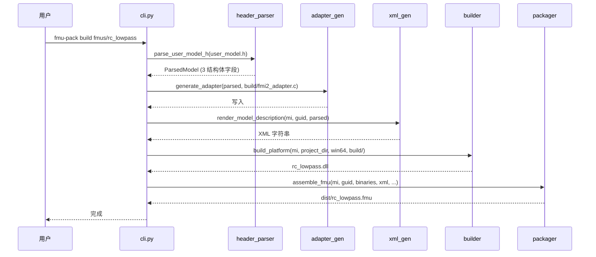
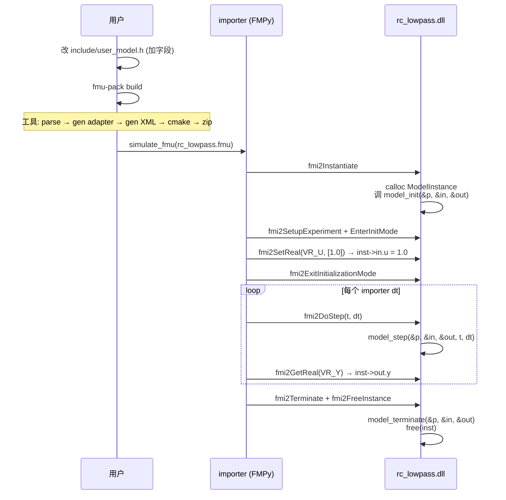

# FMU 与打包工具设计（v2 实际实现版）

> 本文档描述 `fmu-pack` 工具的实际实现设计：用户只写 3 个回调，工具自动生成 FMI 2.0 适配层。
> 配套代码：`tools/fmu_pack/` 和 `fmus/<name>/` 模板。

---

## 1. 一句话定位

> 用户只写 3 个 C 回调（init / step / terminate），工具自动生成完整 FMI 2.0 Co-Simulation FMU。

**核心理念**：
- 3 个固定结构体（按 causality 分组）作为状态容器
- 3 个固定命名的回调作为用户接口
- 工具读 `user_model.h` 正则解析 → 自动分配 VR → 生成适配层代码

---

## 2. 用户视角的项目结构

```
fmus/rc_lowpass/                  # 目录名 = FMU 名（= DLL 基名）
├── CMakeLists.txt                 # init 生成；项目可改
├── README.md                      # init 生成；描述 FMU 功能（用户编辑）
├── include/
│   └── user_model.h               # 用户写：3 结构体 + 3 回调
├── src/
│   └── user_model.c               # 用户写：3 回调实现
└── test/
    └── test_user_model.py         # init 生成；基于 FMPy 的最小测试骨架（用户填充断言）
```

**工具自动生成**（在 `build/` 下，用户不直接编辑）：
```
build/
├── fmi2_adapter.c                 # 含 VR 枚举 + get/set 全类型 + 状态机
├── modelDescription.xml           # 渲染自 ParsedModel
├── .fmu-guid                      # GUID 持久化（首生成后不变）
└── <platform>/<mi>.dll           # 编译产物

dist/
└── <mi>.fmu                      # 打包好的 FMU（zip）
```

---

## 3. 用户合约：`user_model.h`

### 3.1 三个固定结构体

```c
typedef struct {
    double tau;   /* parameter：时间常数（可读可写） */
} UserModelParameterT;

typedef struct {
    double u;     /* input：输入信号（可读可写） */
} UserModelInputT;

typedef struct {
    double y;     /* output：输出（只读） */
} UserModelOutputT;
```

- 结构体名**固定**，工具按名字识别
- 字段类型首期支持 `double` / `int` / `bool` / `char[N]`（→ Real/Integer/Boolean/String）
- 字段顺序 = VR 分配顺序

### 3.2 三个固定回调

```c
int  model_init(UserModelParameterT* p, UserModelInputT* in, UserModelOutputT* out);
int  model_step(UserModelParameterT* p, UserModelInputT* in, UserModelOutputT* out,
                double t, double dt);
void model_terminate(UserModelParameterT* p, UserModelInputT* in, UserModelOutputT* out);
```

- 名字固定 `model_init/step/terminate`，无 prefix
- 第一个参数是 parameter 结构体（可改），第二个 input（可改），第三个 output（用户写）
- 适配层自动持有 3 个结构体实例，回调时传指针

> 步长由 importer（主控）决定，通过 `fmi2DoStep(t, dt)` 的 `dt` 直接传入 `model_step`；FMU 不在内部再切分。

---

## 4. 工具架构

```
tools/fmu_pack/
├── cli.py            # 子命令: init/build/validate/clean/gen-adapter
├── header_parser.py  # 正则解析 user_model.h → ParsedModel
├── adapter_gen.py    # ParsedModel → fmi2_adapter.c 渲染
├── xml_gen.py        # ParsedModel → modelDescription.xml
├── builder.py        # cmake -S/-B + 构建
├── packager.py       # ZIP + SHA256
├── validator.py      # XSD 校验
├── readme_gen.py     # ParsedModel → README.md（FMU 功能设计文档）
├── __init__.py
└── templates/
    ├── fmi2_adapter.c.j2      # 适配层 C 模板
    ├── README.md.j2           # FMU README 模板（功能描述、变量表、使用方法）
    └── test_user_model.py.j2  # 测试脚本模板（FMPy）
```

### 4.1 分层职责

| 模块 | 知道什么 | 不知道什么 |
|---|---|---|
| **header_parser.py** | C 正则、3 结构体识别、字段类型 → FMI 类型 | YAML、CMake、ZIP |
| **adapter_gen.py** | Jinja2 渲染、字段→struct 访问 | FMI 协议、CMake |
| **xml_gen.py** | FMI 2.0 XML schema、ModelStructure 计算 | C 代码、编译 |
| **validator.py** | XSD schema 校验 | 业务逻辑 |
| **builder.py** | CMake out-of-source 构建、平台差异 | FMI 语义 |
| **packager.py** | ZIP 目录结构、SHA256 | 编译 |
| **readme_gen.py** | ParsedModel → Jinja2 渲染 FMU README（变量表 + TODO 占位） | C 代码、CMake |
| **cli.py** | 子命令路由、参数解析 | 模块实现细节 |

---

## 5. 数据流



---

## 6. 关键模块设计

### 6.1 header_parser.py —— C 头解析器

**输入**：`user_model.h` 路径
**输出**：`ParsedModel` 数据类

**实现**：纯正则（`re` 模块），无需 pycparser。

**核心正则**：
```python
# 去掉注释
_RE_BLOCK_COMMENT = re.compile(r"/\*.*?\*/", re.DOTALL)
_RE_LINE_COMMENT  = re.compile(r"//[^\n]*")

# 提取 3 个结构体
_RE_STRUCT = re.compile(
    r"typedef\s+struct(\s+\w+)?\s*\{\s*([^}]*?)\s*\}\s*(\w+)\s*;",
    re.MULTILINE | re.DOTALL,
)

# 提取字段
_RE_FIELD = re.compile(
    r"^\s*(?:const\s+)?([\w\s\*]+?)\s+(\w+)\s*(?:\[[^\]]*\])?\s*(?:=\s*[^;]+)?\s*;",
    re.MULTILINE,
)
```

**ParsedModel 结构**：
```python
@dataclass
class FieldInfo:
    name: str          # 字段名
    c_type: str        # C 类型原文
    fmi_type: str      # "Real" / "Integer" / "Boolean" / "String"
    causality: str     # "parameter" / "input" / "output"

@dataclass
class ParsedModel:
    parameter_fields: list[FieldInfo]
    input_fields:     list[FieldInfo]
    output_fields:    list[FieldInfo]
    has_init/step/terminate: bool
```

**C 类型 → FMI 类型映射**：
| C 类型 | FMI 类型 |
|---|---|
| `double`, `float` | Real |
| `int`, `int32_t`, `long`, `short` | Integer |
| `bool`, `fmi2Boolean` | Boolean |
| `char[N]` | String |

### 6.2 adapter_gen.py —— 适配层代码生成

**输入**：`ParsedModel`
**输出**：`build/fmi2_adapter.c`（~600 行 C）

**模板**：`templates/fmi2_adapter.c.j2`

**Jinja2 循环生成**：
- VR 枚举：按 parameter → input → output 顺序，从 1 开始递增
- getReal/getInteger/getBoolean/getString：switch-case，每个 field 一行
- setReal/setInteger/setBoolean/setString：同上（只对 parameter/input）

**关键设计**：
- `ModelInstance` 直接持有 3 个结构体（不做 void* opaque）
- 用户回调拿到的是具体类型指针，无需 cast
- `fmi2DoStep` 把 importer 给的 `dt` 原样转发给 `model_step`，不在 FMU 内再次切分

### 6.3 xml_gen.py —— modelDescription.xml 渲染

**输入**：`model_identifier`, `guid`, `ParsedModel`
**输出**：XML 字符串

**VR 分配规则**：
```
VR = 1..N_parameter, N_parameter+1..N_param+N_input, N_param+N_input+1..N_total
```

**自动推导字段**：
- `causality`：来自结构体名（Parameter/Input/Output）
- `variability`：parameter 默认 fixed
- `start`：input/parameter 默认为 0.0/0/false/""，output 无
- `description`：`"start=0.0"`（兼容 FMPy 严格校验）

### 6.4 builder.py —— CMake 构建

**签名**：`build_platform(model_identifier, project_dir, platform, build_dir)`

**流程**：
```
cmake -G "MinGW Makefiles" -S <project> -B <build>/<platform>
cmake --build <build>/<platform>
```

**平台产物后缀**：
- `win64` → `.dll`
- `linux64` → `.so`
- `darwin64` → `.dylib`

**Windows 静态运行时**：`target_link_options(... "-static-libgcc" "-static-libstdc++" "-static")` 让 FMU DLL 自包含。

### 6.5 packager.py —— ZIP 组装

**签名**：`assemble_fmu(model_identifier, guid, binaries, xml_path, project_dir, dist_dir)`

**ZIP 结构**：
```
modelDescription.xml
binaries/<platform>/<mi>.<ext>
resources/    (可选)
documentation/ (可选)
```

**后处理**：生成 `<mi>.fmu.sha256` 校验文件。

### 6.6 readme_gen.py —— FMU README 生成

**目的**：每个 FMU 项目自带一份 README.md，用于**描述该 FMU 的功能**（物理含义、数学模型、I/O 关系、使用方法）。这份文档是用户向协作者/AI 解释 FMU 设计意图的入口。

**签名**：`generate_readme(parsed, project_dir)` → 写入 `<project_dir>/README.md`

**模板**：`templates/README.md.j2`，渲染所需变量：
- `model_identifier` — FMU 名（= 目录名）
- `variables` — 从 `ParsedModel` 聚合的字段列表（含 `name / vr / type / causality / variability / start`）

**README 内容骨架**（生成后由用户编辑）：
- **功能** —— 物理含义 / 数学模型 / 输入输出关系（带 TODO 占位）
- **变量表** —— 工具按 `ParsedModel` 自动列出 `parameter / input / output`，含 VR、类型、start 值、说明（说明列留 TODO）
- **构建** —— `fmu-pack build` 命令
- **测试** —— `python test/test_user_model.py` 命令
- **项目结构** —— 列出 5 个用户文件 + 自动生成产物

**生成时机**：**只在 `fmu-pack init` 阶段生成一次**。后续 `fmu-pack build` 不再覆写 README——用户编辑完全保留。如果改 `user_model.h`（增删字段）后需要更新 README 变量表，需手动同步。

> README 是**项目级**文档（不入 FMU ZIP），只服务于源码阅读者；FMU 包内的 `documentation/` 由后续可选步骤处理（不在本设计范围）。

### 6.7 test/test_user_model.py —— 测试脚本生成

**目的**：工具生成 `test/` 目录并产出 `test/test_user_model.py` 最小骨架，让用户只填入断言即可验证 FMU。

**签名**：`generate_test(parsed, project_dir)` → 写入 `<project_dir>/test/test_user_model.py`

**模板**：`templates/test_user_model.py.j2`，依赖 FMPy（`pip install fmpy`）。

**生成内容**：
- 自动从 `ParsedModel` 聚合 `input` 变量名 → 构造零输入信号
- 自动从 `ParsedModel` 聚合 `output` 变量名 → 作为 FMPy `output` 参数
- 留 TODO 占位让用户填：
  - 输入信号曲线（如阶跃、斜坡）
  - 关键时间点的物理预期值断言
- 默认 `stop_time=10` / `step_size=0.1`（可在模板顶层调整）

**位置**：脚本固定在 `<fmudir>/test/test_user_model.py`（命名固定为 `test_user_model.py`，避免与用户后续加的 `test_xxx.py` 冲突）。

**生成时机**：**只在 `fmu-pack init` 阶段生成一次**。后续 `fmu-pack build` 不再覆写——用户在脚本里填的输入信号和断言完全保留。如果改 `user_model.h`（增删 input/output 字段）后需要更新测试，需手动同步 `input_names` / `output_vars` 列表。

---

## 7. CLI 子命令

| 命令 | 作用 |
|---|---|
| `fmu-pack init [dir]` | 生成完整项目骨架：user_model.h/.c、CMakeLists.txt、README.md、test/test_user_model.py、build/ 下的 adapter + XML |
| `fmu-pack build [dir]` | 解析 → 生成 adapter + XML → 编译 → 打包（**不**重新生成 README/test，由用户维护） |
| `fmu-pack validate [dir]` | 解析 user_model.h + 渲染 XML + XSD 校验 |
| `fmu-pack gen-adapter [dir]` | 仅重新生成 build/fmi2_adapter.c |
| `fmu-pack clean [dir]` | 清理 build/ dist/ |

**退出码**：
- 0 成功
- 2 user_model.h 解析失败
- 3 XSD 校验失败
- 4 编译失败
- 5 打包失败

---

## 8. 端到端时序



---

## 9. 关键设计决策

| 决策 | 选择 | 理由 |
|---|---|---|
| FMU 名称 | 目录名 | 无需配置；改目录名 = 改 FMU 名 |
| 状态持有 | 适配层直接持有 3 结构体 | 无 void* cast、调试简单 |
| VR 分配 | 工具按字段顺序自动 | 用户零负担、不会漂移 |
| get/set | 工具生成（4 套：Real/Integer/Boolean/String） | 用户零代码、覆盖所有 FMI 类型 |
| 步长 | importer 通过 `fmi2DoStep(t, dt)` 传入 | 主控负责，FMU 不切分 |
| 头解析 | 纯正则 | 零依赖、足够 |
| C 接口 | 适配层 + 模板生成 | 用户不写 FMI 代码 |
| GUID 持久化 | `build/.fmu-guid` | 不污染用户目录，clean 后重建保持稳定 |

---

## 10. 完整文件清单

### 工具源码（8 个 Python 文件）
- `tools/fmu_pack/cli.py` — CLI 入口
- `tools/fmu_pack/header_parser.py` — C 头解析
- `tools/fmu_pack/adapter_gen.py` — 适配层生成
- `tools/fmu_pack/xml_gen.py` — XML 渲染
- `tools/fmu_pack/builder.py` — CMake 构建
- `tools/fmu_pack/packager.py` — ZIP 打包
- `tools/fmu_pack/validator.py` — XSD 校验
- `tools/fmu_pack/readme_gen.py` — FMU README 生成

### 模板（3 个）
- `tools/fmu_pack/templates/fmi2_adapter.c.j2` — 适配层 C 模板
- `tools/fmu_pack/templates/README.md.j2` — FMU 功能描述 README 模板（变量表 + TODO 占位）
- `tools/fmu_pack/templates/test_user_model.py.j2` — FMPy 测试脚本模板

### 自动生成脚本
- `tools/fmu_pack/readme_gen.py` — ParsedModel → `<fmudir>/README.md`（Jinja2）

### 第三方
- `third_party/fmi2/` — FMI 2.0 头文件 + XSD
- `third_party/zeromq/` — ZeroMQ 4.3.5 静态库（可选，给 C++ 外部库项目用）

### 用户项目（每个 FMU 5 个文件）
- `fmus/<name>/CMakeLists.txt` — 构建配置（init 生成，可改）
- `fmus/<name>/README.md` — FMU 功能设计文档（init 生成，用户编辑内容）
- `fmus/<name>/include/user_model.h` — 状态结构体 + 回调声明（用户编辑）
- `fmus/<name>/src/user_model.c` — 回调实现（用户编辑）
- `fmus/<name>/test/test_user_model.py` — FMPy 仿真 + 断言脚本（init 生成骨架，用户填断言）
