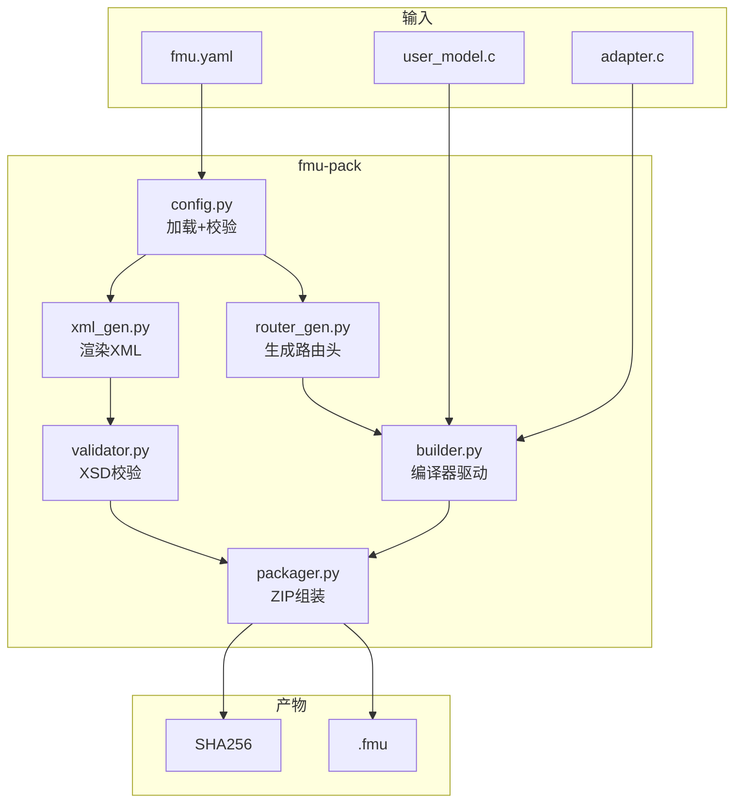
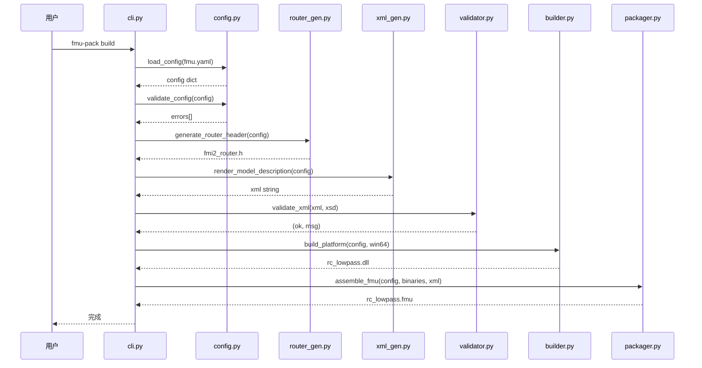
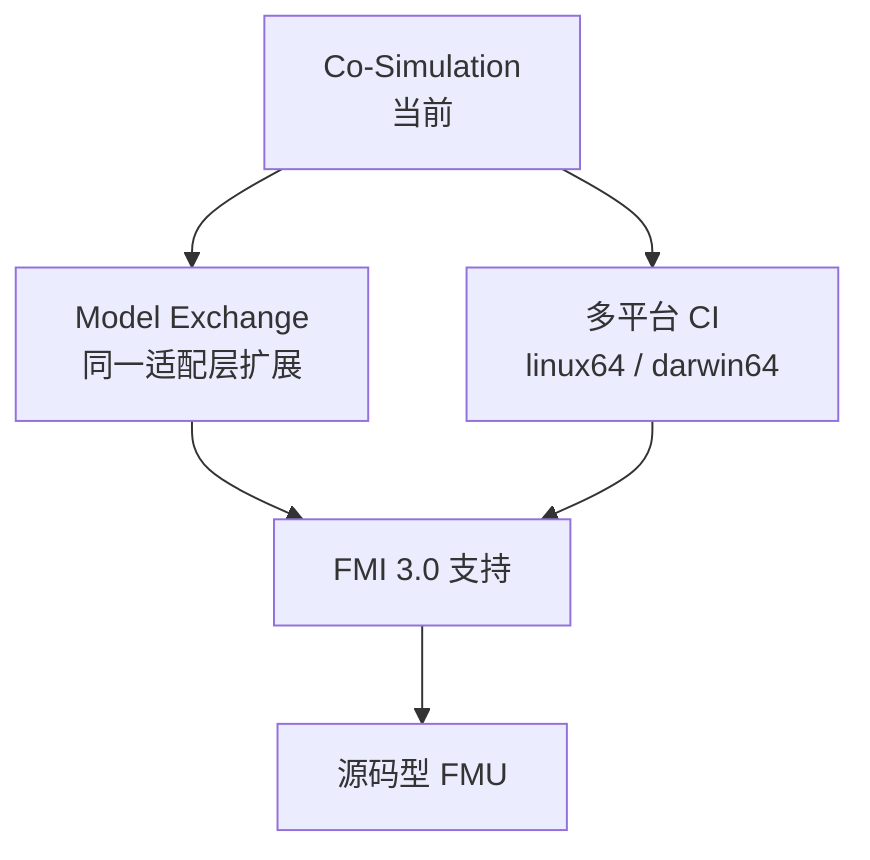

# fmu-pack: FMI 2.0 FMU 打包工具设计文档

> 本文档描述 `tools/fmu_pack/` 的设计，只写 why / what / 架构 / 模块边界 / 数据流 / 接口约定；
> 不贴具体代码实现。

---

## 1. 概述

`fmu-pack` 是一个 Python CLI 工具，将用户 C 数值模型封装为符合 **FMI 2.0 Co-Simulation** 规范的 `.fmu` 文件。

### 1.1 一句话定位

> 给定 `fmu.yaml` + C 源码 → 一行命令产出标准 `.fmu`。

### 1.2 与 fmi-standard 仓库的关系

| 能力 | fmi-standard 仓库 | fmu-pack |
|---|---|---|
| FMI 2.0 头文件 | ❌ 仓库仅 3.0 | 从 v2.0.x 分支提取到 `third_party/fmi2/` |
| FMI 2.0 XSD | ❌ | 同上 |
| modelDescription.xml 生成 | ❌ | ✅ Jinja2 模板渲染 |
| C 源码编译 | ❌ | ✅ 直接调用系统编译器 |
| .fmu ZIP 打包 | ❌ | ✅ 符合 FMI 2.0 目录结构 |
| XSD 校验 | ❌ | ✅ lxml 校验 |

---

## 2. 项目目录结构

```
fmu_test/
├── tools/
│   └── fmu_pack/              # FMU 打包工具（Python 包）
│       ├── __init__.py         # 包入口，版本号
│       ├── cli.py              # CLI 入口，6 个子命令
│       ├── config.py           # fmu.yaml 加载/校验/GUID 固化
│       ├── router_gen.py       # VR 路由头生成器
│       ├── xml_gen.py          # modelDescription.xml Jinja2 渲染
│       ├── validator.py        # XSD schema 校验
│       ├── builder.py          # 编译器驱动
│       └── packager.py         # ZIP 组装 + SHA256
├── fmus/
│   ├── rc_lowpass/             # RC 低通滤波器 demo
│   │   ├── fmu.yaml
│   │   ├── include/
│   │   │   ├── user_model.h
│   │   │   └── fmi2_router.h   # 工具生成
│   │   └── src/
│   │       ├── user_model.c
│   │       └── fmi2_adapter.c
│   └── zeromq_sub/             # ZeroMQ 订阅 FMU
│       ├── fmu.yaml
│       ├── include/
│       └── src/
├── third_party/
│   ├── fmi2/                   # FMI 2.0 头文件 + XSD
│   │   ├── include/
│   │   └── schema/
│   └── zeromq/                 # ZeroMQ 静态库
│       ├── include/            # zmq.h, zmq_utils.h
│       └── lib/                # libzmq.a
├── doc/
│   └── 设计_fmu-pack.md        # 本文档
└── requirements.txt            # Python 依赖
```

---

## 3. 架构



### 3.1 分层职责

| 模块 | 知道什么 | 不知道什么 |
|---|---|---|
| config.py | YAML 结构、FMI 2.0 字段约束 | C 代码、编译细节 |
| router_gen.py | vr↔字段名映射、枚举生成 | XML、zip |
| xml_gen.py | FMI 2.0 XML schema、Jinja2 模板 | 编译、C 代码 |
| validator.py | XSD schema 校验 | 业务逻辑 |
| builder.py | 编译器命令行、平台差异 | FMI 语义 |
| packager.py | ZIP 目录结构、SHA256 | 编译 |

---

## 4. 关键模块设计

### 4.1 config.py —— 配置加载与校验

**输入**: `fmu.yaml` 文件路径

**处理**:
1. YAML 解析
2. GUID 自动生成（首次 `"auto"` → UUIDv4，写回文件固化）
3. 逐字段校验（见 §5.1 契约约束）

**输出**: 配置字典 + 错误列表

### 4.2 router_gen.py —— VR 路由头生成

**输入**: 配置字典（variables 列表 + model.state_type）

**输出**: `fmi2_router.h`

**生成内容**:
- `valueReference` 枚举（`VR_TAU = 1, VR_U = 2, ...`）
- `getReal` 路由函数（static inline, switch-case）
- `setReal` 路由函数（仅 input/parameter 可写）

**关键设计决策**:
- 路由函数使用用户定义的结构体类型（`model.state_type`），不自建结构体
- 函数声明为 `static inline`，避免链接冲突
- output 变量不出现在 setReal 路由中

### 4.3 xml_gen.py —— XML 模板渲染

**输入**: 配置字典

**输出**: `modelDescription.xml` 字符串

**模板变量**:
- `fmi.version`, `fmi.kind`, `fmi.modelIdentifier`, `fmi.guid`, `fmi.generationTool`
- `variables`: 变量列表
- `outputs`: causality=output 的 1-based 索引
- `generation_time`: UTC 时间戳

**ModelStructure 计算规则**:
- Outputs: 所有 `causality=output` 的变量索引
- Derivatives: `causality=local` 且标记了 derivative 的变量
- InitialUnknowns: `initial=approx` 的 output/local 变量

### 4.4 validator.py —— XSD 校验

**输入**: XML 字符串 + XSD 文件路径

**校验流程**:
1. `etree.fromstring` 解析 XML
2. `etree.parse` + `XMLSchema` 加载 XSD
3. `assertValid` 全量校验

**错误类型**: XMLSyntaxError / XMLSchemaParseError / DocumentInvalid

### 4.5 builder.py —— 编译器驱动

**输入**: 配置 + 项目目录 + 目标平台

**构建策略**:
- 不使用 CMake（减少依赖），直接调用编译器命令行
- Windows: 优先 MSVC (cl)，回退 MinGW (gcc)
- 编译选项: `-shared -O2`，Windows 上定义 `FMI2_Export=__declspec(dllexport)`

**产物**: `<modelIdentifier>.dll`（win64）/ `.so`（linux64）/ `.dylib`（darwin64）

### 4.6 packager.py —— ZIP 组装

**输入**: 配置 + 二进制字典 + XML 路径 + 项目目录

**ZIP 内部结构**:
```
modelDescription.xml
binaries/win64/<mi>.dll
resources/          (可选)
documentation/      (可选)
```

**平台目录映射**（FMI 2.0 约定）:
| 平台 | 目录 |
|---|---|
| win64 | `binaries/win64/` |
| linux64 | `binaries/linux64/` |
| darwin64 | `binaries/darwin64/` |

**后处理**: 生成 SHA256 manifest 文件

---

## 5. 接口约定

### 5.1 `fmu.yaml` 契约

```yaml
fmi:
  version: "2.0"               # 强制 2.0
  kind: "CoSimulation"          # 首期只支持 CoSimulation
  modelIdentifier: "MyModel"   # → dll 基名
  guid: "auto"                  # 缺省自动生成 UUIDv4
  generationTool: "fmu-pack 0.1.0"

variables:
  - { name: "tau", vr: 1, type: "Real", causality: "parameter", start: 1.0, variability: "fixed" }
  - { name: "u",   vr: 2, type: "Real", causality: "input" }
  - { name: "y",   vr: 3, type: "Real", causality: "output" }

model:
  step: "euler"                 # 积分器类型
  state_type: "RcState"         # 用户模型状态结构体类型名
  sources: ["src/user_model.c"] # C 源文件列表

platforms: ["win64"]            # 目标平台
```

**契约约束**:
1. `vr` 唯一，正整数，≥ 1
2. `causality=output` 不能有 `start`
3. `causality=parameter` 必须有 `variability=fixed|tunable|discrete`
4. `modelIdentifier` 匹配 `[A-Za-z_][A-Za-z0-9_]*`
5. `guid` 一旦生成就不可变

### 5.2 用户模型 ↔ 适配层（C ABI）

用户模型暴露三个回调：
- `xxx_init(state)` — 初始化
- `xxx_step(state, t, dt)` — 单步推进
- `xxx_terminate(state)` — 销毁

适配层通过 `fmi2_router.h` 中的路由函数访问模型状态字段。

### 5.3 CLI 接口

| 命令 | 作用 | 退出码 |
|---|---|---|
| `fmu-pack init [dir]` | 生成 fmu.yaml 模板 | 0/1 |
| `fmu-pack validate [--xsd]` | 校验配置 + XSD | 0/2/3 |
| `fmu-pack build [--platform] [--xsd]` | 完整构建 | 0/2/3/4/5 |
| `fmu-pack gen-router` | 仅生成路由头 | 0 |
| `fmu-pack inspect <fmu>` | 查看 FMU 内部结构 | 0/1 |
| `fmu-pack clean [dir]` | 清理 build/ dist/ | 0 |

**退出码**:
| 码 | 含义 |
|---|---|
| 0 | 成功 |
| 1 | 一般错误 |
| 2 | fmu.yaml 校验失败 |
| 3 | XML/XSD 校验失败 |
| 4 | 构建失败 |
| 5 | 打包失败 |

---

## 6. 数据流



---

## 7. 依赖

| 项 | 选型 | 用途 |
|---|---|---|
| Python | ≥ 3.10 | 运行环境 |
| Jinja2 | ≥ 3.0 | XML 模板渲染 |
| lxml | ≥ 4.9 | XSD schema 校验 |
| PyYAML | ≥ 6.0 | fmu.yaml 解析 |
| GCC/MinGW | 系统安装 | C 编译 |
| ZeroMQ | 4.3.5 (静态库) | zeromq_sub FMU 网络通信 |

---

## 8. 扩展方向



- **Model Exchange**: 适配层加 `fmi2GetDerivatives` / `fmi2GetContinuousStates` 等
- **多平台**: GitHub Actions 矩阵构建
- **FMI 3.0**: 切换头文件 + 适配层复制一份 `fmi3_adapter.c`
- **源码型 FMU**: `fmu.yaml` 加 `distribution=source`，打包时包含 `sources/`
